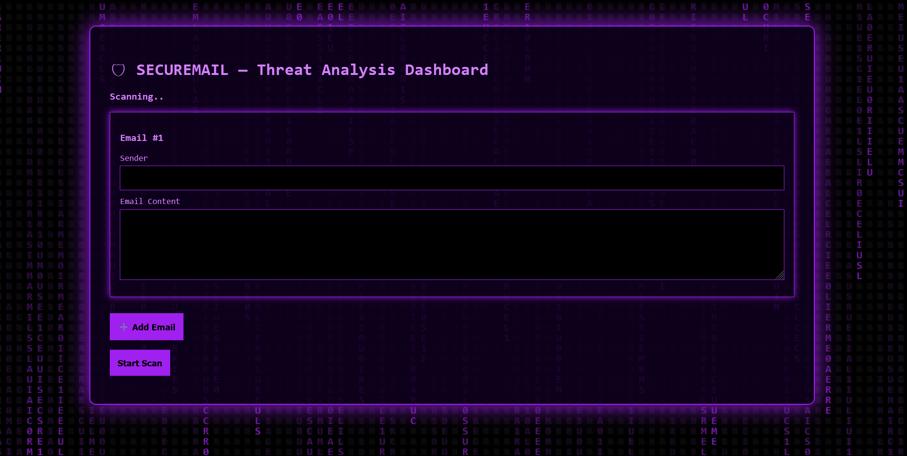
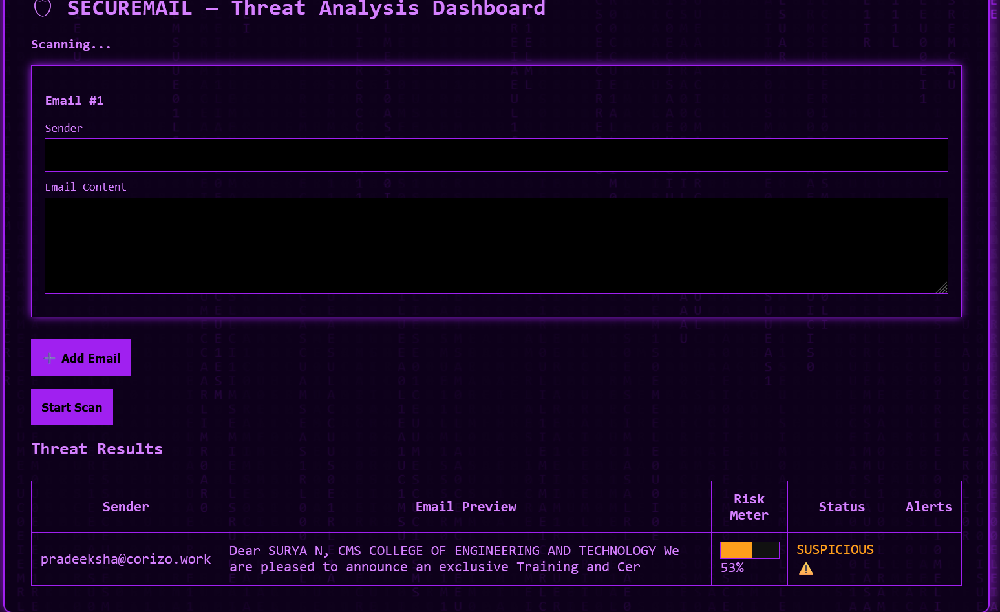

# 🛡️ SecureMail AI

AI-Powered Phishing Email Detection System

## Live Demo

https://securemail-mkt6.onrender.com
---

## Features

- Phishing Detection
- URL Analysis
- DNS Verification
- Sender Validation
- Risk Scoring
- Admin Dashboard

---

## Installation

### Windows

```bash
git clone https://github.com/suryanagalingam877-code/securemail.git

cd securemail

pip install -r requirements.txt

python app.py
```

---

### Linux

```bash
sudo apt update

git clone https://github.com/suryanagalingam877-code/securemail.git

cd securemail

python3 -m venv venv

source venv/bin/activate

pip install -r requirements.txt

python3 app.py
```

---

## Project Structure

```text
securemail/
├── app.py
├── config.py
├── database.py
├── requirements.txt
├── templates/
├── static/
├── detection/
└── ml_pipeline/
```

---

## Technology Stack

- Python
- Flask
- Scikit-Learn
- SQLite
- DNSPython

---

## License

MIT License
## Screenshots

### Home Page



### Detection Result



